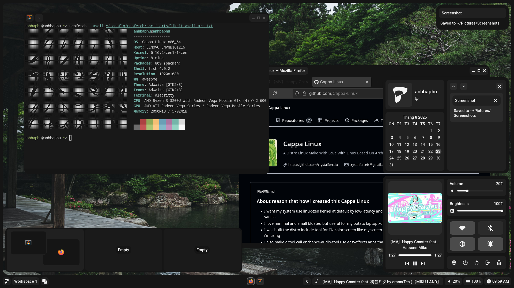

# axskel-awesome

Calla (made by [Stardust-kyun](https://github.com/stardust-kyun)) is the second desktop environment for AxOS. It is a lightweight desktop environment. It is the most resource-efficient desktop environment of the 3.

> [!IMPORTANT]
> This version of calla is not the same as the one in the package database (axmirrors) because some changes need to be made.

## Screenshots 

## Dependencies

- `xorg-server`
- `pipewire-pulse`
- `brightnessctl`
- `inotify-tools`
- `awesome-git`
- `picom`
- `maim`
- `papirus-icon-theme`
- `noto-fonts`
- `noto-fonts-cjk`
- `noto-color-emoji-fontconfig`
- `noto-fonts-extra`
- `lua-pam-git`

### Optional

- `st`: Terminal emulator
- `vim-gtk3`: Vim with clipboard support
- `nemo`: File manager
- `network-manager-gnome`: Network applet
- `polkit-gnome`: Polkit authentication agent
- `cbatticon`: Battery status applet
- `blueman`: Bluetooth manager
- `xdg-user-dirs`: Generates standard home directories

---

